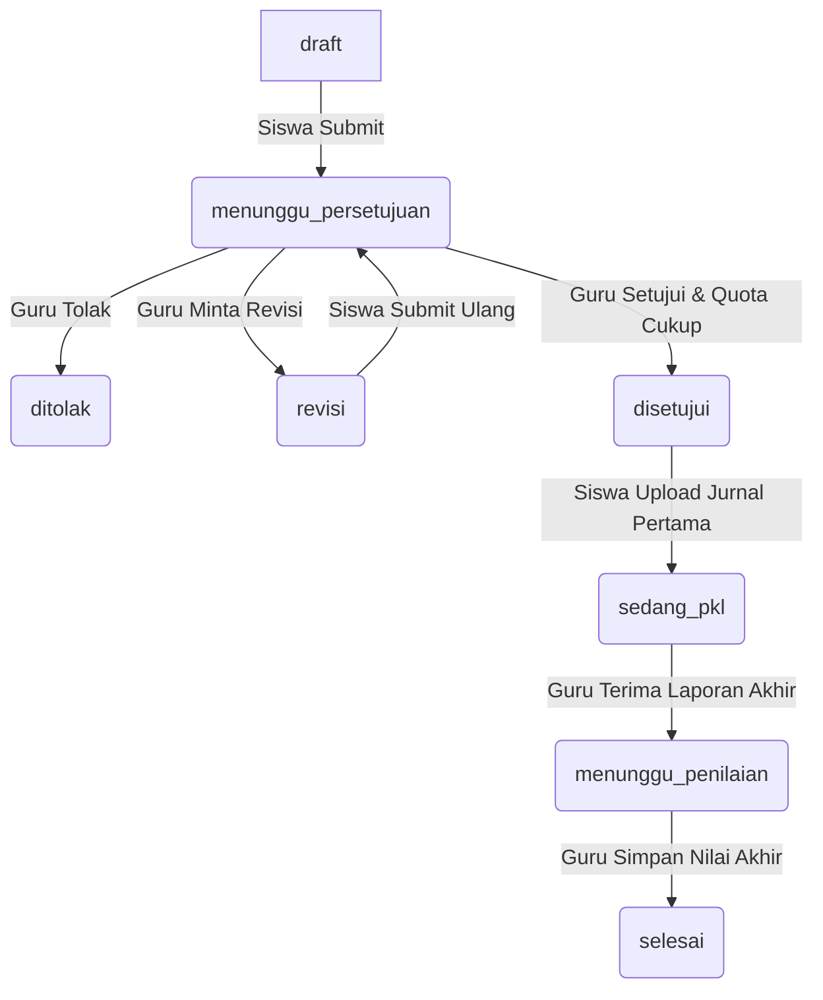

# Spesifikasi Produk SPARTA: Sistem Informasi Praktik Kerja Lapangan (PKL)

Dokumen ini menjelaskan tujuan, fitur, dan alur kerja (workflow) dari aplikasi **SPARTA**, sistem manajemen Praktik Kerja Lapangan (PKL) berbasis Laravel 12.

---

## 1. Tujuan Produk (Purpose)

**SPARTA** dirancang untuk mendigitalisasi dan menyederhanakan administrasi program Praktik Kerja Lapangan (PKL) bagi sekolah menengah kejuruan (SMK) atau institusi serupa. 

Tujuan utama sistem ini meliputi:
* **Sentralisasi Data**: Mengintegrasikan data Siswa, Guru Pembimbing, Tempat PKL (Dunia Usaha/Dunia Industri), dan Pembimbing Industri dalam satu platform.
* **Efisiensi Pengajuan**: Mengotomatiskan proses pengajuan magang, pengecekan kuota tempat PKL, hingga persetujuan oleh guru pembimbing.
* **Pemantauan Real-time**: Memungkinkan guru dan pembimbing industri memantau kehadiran harian (absensi) dan aktivitas harian (jurnal) siswa secara langsung.
* **Standardisasi Penilaian**: Memfasilitasi proses pengumpulan laporan akhir, penilaian dari guru, dan penerbitan sertifikat PKL setelah seluruh proses selesai secara terstruktur.

---

## 2. Fitur Produk (Product's Features)

Sistem ini memiliki fitur-fitur yang dikelompokkan berdasarkan 4 (empat) peran pengguna:

### A. Fitur Siswa (Siswa)
* **Pengajuan PKL**:
  * Mengajukan penempatan PKL ke instansi/perusahaan tertentu.
  * Mengunggah dokumen pengajuan (format PDF/DOC/DOCX, maks 2 MB).
  * Melacak status pengajuan secara real-time.
* **Absensi Harian**:
  * Melakukan pencatatan kehadiran (*clock-in*) sekali setiap hari selama masa PKL aktif.
* **Jurnal Harian**:
  * Mengisi log harian tentang aktivitas yang dilakukan selama PKL.
  * Mengunggah bukti dokumentasi kegiatan (JPG/JPEG/PNG/PDF, maks 2 MB).
* **Laporan Akhir**:
  * Mengunggah file laporan akhir PKL (format PDF, maks 5 MB).
  * Melakukan revisi dan unggah ulang laporan jika diminta oleh Guru Pembimbing.
* **Sertifikat PKL**:
  * Mengunduh/mencetak sertifikat PKL setelah status pengajuan dinyatakan `selesai` (telah dinilai).

### B. Fitur Guru Pembimbing (Guru)
* **Manajemen Bimbingan**:
  * Memantau daftar siswa yang berada di bawah bimbingannya (`guru_id`).
* **Verifikasi & Persetujuan Pengajuan**:
  * Meninjau berkas pengajuan PKL siswa.
  * Menyetujui, menolak, atau meminta revisi pengajuan PKL siswa dengan mempertimbangkan kuota perusahaan.
* **Validasi Jurnal**:
  * Memvalidasi jurnal harian yang dikirim siswa (mengubah status menjadi `valid` atau meminta `revisi`).
* **Review Laporan**:
  * Memeriksa laporan akhir siswa, menyetujui, atau meminta revisi laporan.
* **Penilaian Akhir**:
  * Menginput nilai sikap, nilai keterampilan, dan nilai laporan untuk menghitung nilai akhir rata-rata.
  * Mengubah status PKL siswa menjadi selesai secara otomatis setelah penilaian tersimpan.

### C. Fitur Pembimbing Industri (Pembimbing Industri)
* **Pemantauan Absensi**:
  * Melihat rekam kehadiran (absensi) harian siswa yang magang di tempat industrinya.
* **Validasi Jurnal Bersama**:
  * Melakukan validasi terhadap jurnal harian siswa secara paralel dengan Guru Pembimbing.

### D. Fitur Administrator (Admin)
* **Manajemen Data Master (CRUD)**:
  * Mengelola data Pengguna (Siswa, Guru, Pembimbing Industri, dan Admin).
  * Mengelola data Tempat PKL (Perusahaan/Instansi) lengkap dengan kapasitas/kuota maksimal.
* **Persetujuan Registrasi Pengguna**:
  * Memverifikasi dan menyetujui akun baru yang mendaftar secara mandiri (`is_approved = true`). Akun yang dibuat langsung oleh Admin otomatis disetujui.
* **Plotting Guru Pembimbing**:
  * Menentukan dan memetakan Guru Pembimbing (`guru_id`) untuk setiap pengajuan PKL siswa.

### E. Fitur Umum (Shared & System Features)
* **Sistem Notifikasi**:
  * Notifikasi instan (In-App Database & Email) untuk peristiwa penting seperti perubahan status pengajuan, unggah jurnal baru, atau unggah laporan oleh siswa.
* **Pembatasan Akses**:
  * Role Middleware yang memastikan setiap peran hanya dapat mengakses halaman dan data yang menjadi haknya.

---

## 3. Alur Kerja Sistem (How It Should Work)

Aktivitas magang di SPARTA mengikuti siklus hidup (*lifecycle*) status yang terintegrasi dari awal pendaftaran hingga selesai:

### A. Siklus Status Pengajuan PKL
Pengajuan PKL oleh Siswa melewati transisi status berikut:

1. **Pendaftaran & Pengajuan**:
   * Siswa membuat draf pengajuan tempat PKL (status: `draft`). Siswa hanya diperbolehkan memiliki satu pengajuan aktif dalam satu waktu (kecuali pengajuan sebelumnya berstatus `ditolak` atau `selesai`).
   * Siswa mengirimkan pengajuan (status: `menunggu_persetujuan`).
2. **Proses Seleksi & Kuota**:
   * Guru memeriksa kuota Tempat PKL. Kuota dihitung berdasarkan jumlah siswa yang berstatus `disetujui`, `sedang_pkl`, dan `menunggu_penilaian`.
   * Jika kuota penuh, pengajuan tidak dapat disetujui.
   * Guru dapat mengubah status menjadi `disetujui`, `ditolak`, atau meminta `revisi`.
3. **Pelaksanaan PKL**:
   * Ketika pengajuan disetujui (`disetujui`), siswa dapat mulai melakukan absensi harian dan mengisi jurnal harian.
   * Saat siswa mengunggah jurnal harian pertama kalinya, status otomatis berubah dari `disetujui` menjadi `sedang_pkl`.
4. **Pelaporan & Validasi**:
   * Setiap hari siswa melakukan *clock-in* absensi dan mengunggah jurnal kegiatan. Jurnal harus divalidasi oleh Guru Pembimbing dan Pembimbing Industri (`menunggu_validasi` &rarr; `valid`/`revisi`).
   * Di akhir masa PKL, siswa mengunggah Laporan Akhir (status laporan: `menunggu_review`).
   * Jika laporan disetujui oleh Guru Pembimbing, status pengajuan PKL berubah dari `sedang_pkl` menjadi `menunggu_penilaian`.
5. **Penilaian & Sertifikasi**:
   * Guru menginput nilai untuk 3 komponen: Sikap, Keterampilan, dan Laporan.
   * Nilai Akhir dihitung dengan rumus:
     $$\text{Nilai Akhir} = \text{round}\left(\frac{\text{Nilai Sikap} + \text{Nilai Keterampilan} + \text{Nilai Laporan}}{3}, 2\right)$$
   * Setelah penilaian disimpan, status pengajuan berubah menjadi `selesai`.
   * Siswa kini dapat mencetak sertifikat PKL resmi dari sistem.

---

## 4. Aturan Validasi File Unggahan

| Jenis File | Folder Penyimpanan | Format yang Diizinkan | Ukuran Maksimal |
| :--- | :--- | :--- | :--- |
| **Dokumen Pengajuan** | `storage/app/public/pengajuan/` | `.pdf`, `.doc`, `.docx` | 2048 KB (2 MB) |
| **Dokumentasi Jurnal** | `storage/app/public/jurnal/` | `.jpg`, `.jpeg`, `.png`, `.pdf` | 2048 KB (2 MB) |
| **Laporan Akhir** | `storage/app/public/laporan/` | `.pdf` | 5120 KB (5 MB) |
