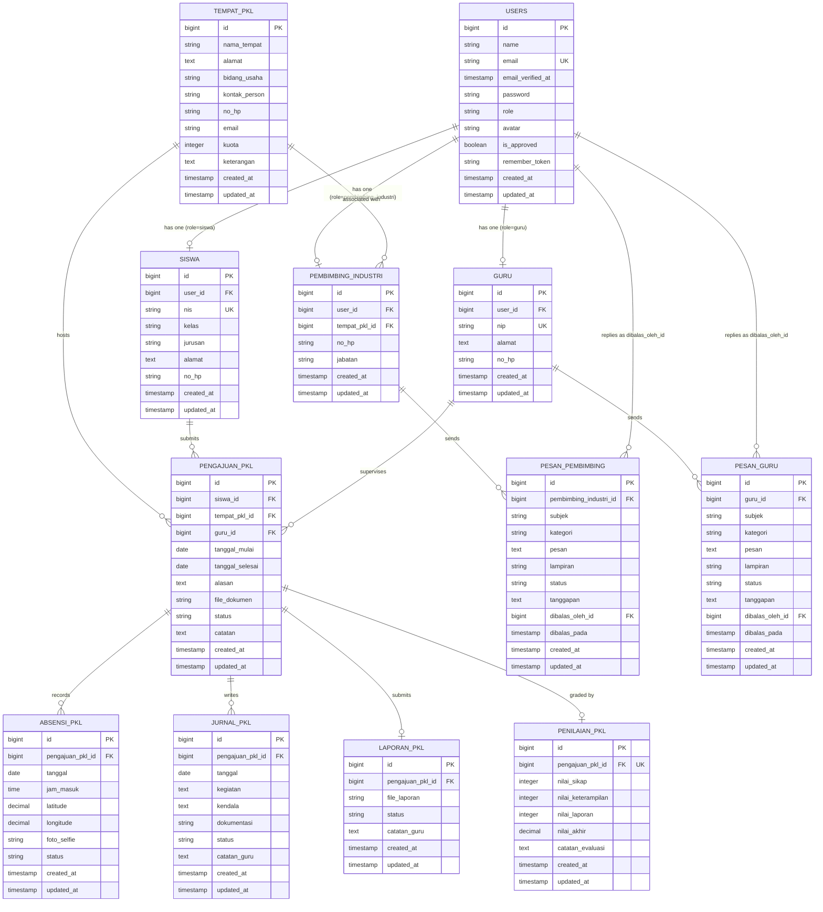

# BAB III
# ANALISIS DAN PERANCANGAN SISTEM

## 3.1 PERANCANGAN

Perancangan sistem merupakan tahapan lanjutan setelah melakukan analisis terhadap kebutuhan fungsional dan non-fungsional dari aplikasi **SiPKL (Sistem Informasi Praktik Kerja Lapangan)**. Tujuan utama perancangan ini adalah untuk menggambarkan struktur sistem secara logis, pemetaan aliran data, skema basis data, dan rancangan antarmuka pengguna agar sistem dapat dibangun sesuai spesifikasi teknis.

---

### 3.1.1 Perancangan Sistem

Perancangan aliran data sistem digambarkan menggunakan Diagram Konteks untuk melihat interaksi sistem secara makro dengan entitas luar, dilanjutkan dengan Data Flow Diagram (DFD) Level 0 untuk menjabarkan proses-proses utama di dalam sistem.

#### 3.1.1.1 Diagram Konteks (Context Diagram)

Diagram Konteks di bawah ini memperlihatkan batas sistem (**Sistem Informasi PKL / SiPKL**) serta aliran data masuk dan keluar dari empat entitas luar utama: **Siswa**, **Guru Pembimbing**, **Pembimbing Industri**, dan **Administrator**.

```mermaid
graph TD
    %% Entitas Luar
    Siswa["Siswa (Siswa PKL)"]
    Guru["Guru Pembimbing"]
    PemInd["Pembimbing Industri"]
    Admin["Administrator (Admin)"]

    %% Batas Sistem
    Subsystem["SISTEM INFORMASI PRAKTIK KERJA LAPANGAN (SiPKL)"]

    %% Aliran Data Siswa
    Siswa -->|1. Data Registrasi & Profil\n2. Form Pengajuan PKL & Berkas\n3. Absensi Clock-In (Foto & Lokasi)\n4. Jurnal Harian & Dokumentasi\n5. Berkas Laporan Akhir| Subsystem
    Subsystem -->|1. Status Pengajuan PKL\n2. Riwayat Absensi & Jurnal\n3. Catatan Revisi Laporan\n4. Nilai Akhir & Sertifikat PKL| Siswa

    %% Aliran Data Guru Pembimbing
    Guru -->|1. Validasi Jurnal\n2. Review & Status Laporan Akhir\n3. Input Nilai Sikap, Keterampilan, Laporan\n4. Balasan Pesan ke Admin| Subsystem
    Subsystem -->|1. Data Siswa Bimbingan\n2. Notifikasi Jurnal & Laporan Baru\n3. Pesan/Pertanyaan dari Admin| Guru

    %% Aliran Data Pembimbing Industri
    PemInd -->|1. Validasi Jurnal\n2. Pesan Kendala/Teknis/Administrasi| Subsystem
    Subsystem -->|1. Data Siswa Magang\n2. Rekap Absensi Siswa\n3. Notifikasi Jurnal Baru| PemInd

    %% Aliran Data Admin
    Admin -->|1. CRUD Data Master (User, Tempat PKL)\n2. Plotting Guru Pembimbing ke Siswa\n3. Approval Registrasi User\n4. Balasan Tanggapan Pesan| Subsystem
    Subsystem -->|1. Laporan Data Master\n2. Request Approval User Baru\n3. Rekap Pesan Masuk dari Guru/Pembimbing| Admin

    %% Styling
    style Subsystem fill:#0f172a,stroke:#38bdf8,stroke-width:3px,color:#fff
    style Siswa fill:#1e293b,stroke:#a855f7,stroke-width:2px,color:#fff
    style Guru fill:#1e293b,stroke:#22c55e,stroke-width:2px,color:#fff
    style PemInd fill:#1e293b,stroke:#eab308,stroke-width:2px,color:#fff
    style Admin fill:#1e293b,stroke:#ef4444,stroke-width:2px,color:#fff
```

#### 3.1.1.2 Diagram Flow (DFD Level 0)

Data Flow Diagram (DFD) Level 0 menjabarkan proses-proses utama yang terjadi dalam SiPKL serta interaksinya dengan data store (tabel basis data).

```mermaid
graph TD
    %% Entitas Luar
    S[Siswa]
    G[Guru Pembimbing]
    PI[Pembimbing Industri]
    A[Admin]

    %% Proses Utama
    P1(("1.0<br/>Autentikasi &<br/>Registrasi"))
    P2(("2.0<br/>Manajemen<br/>Data Master"))
    P3(("3.0<br/>Pengajuan &<br/>Penempatan PKL"))
    P4(("4.0<br/>Absensi &<br/>Jurnal Harian"))
    P5(("5.0<br/>Laporan Akhir<br/>PKL"))
    P6(("6.0<br/>Penilaian &<br/>Sertifikasi"))
    P7(("7.0<br/>Komunikasi &<br/>Pesan"))

    %% Data Stores
    D1[("users")]
    D2[("siswa / guru / pembimbing_industri")]
    D3[("tempat_pkl")]
    D4[("pengajuan_pkl")]
    D5[("absensi_pkl")]
    D6[("jurnal_pkl")]
    D7[("laporan_pkl")]
    D8[("penilaian_pkl")]
    D9[("pesan_pembimbing / pesan_guru")]

    %% Aliran Proses 1.0 (Autentikasi & Registrasi)
    S & G & PI -->|Register / Login| P1
    P1 -->|Cek Kredensial & Status is_approved| D1
    A -->|Approve Akun Baru| P1
    P1 -->|Update Status Akun| D1

    %% Aliran Proses 2.0 (Manajemen Data Master)
    A -->|Input Data Guru/Siswa/Industri/Tempat PKL| P2
    P2 -->|CRUD| D2
    P2 -->|CRUD Kuota & Detail| D3

    %% Aliran Proses 3.0 (Pengajuan & Penempatan PKL)
    S -->|Buat Draft & Ajukan PKL| P3
    P3 -->|Cek Kuota & Buat Pengajuan| D4
    P3 -.->|Baca Kuota Tempat PKL| D3
    G -->|Verifikasi Pengajuan (Setuju/Revisi/Tolak)| P3
    A -->|Plotting Guru Pembimbing| P3
    P3 -->|Update Status & Guru ID| D4

    %% Aliran Proses 4.0 (Absensi & Jurnal Harian)
    S -->|Clock-In Absensi & Submit Jurnal| P4
    P4 -->|Simpan Absensi| D5
    P4 -->|Simpan Jurnal| D6
    G & PI -->|Validasi Jurnal| P4
    P4 -->|Update Status Jurnal| D6

    %% Aliran Proses 5.0 (Laporan Akhir PKL)
    S -->|Unggah Laporan Akhir| P5
    P5 -->|Simpan File Laporan| D7
    G -->|Review & Setujui/Revisi Laporan| P5
    P5 -->|Update Status Laporan & Pengajuan| D4
    P5 -->|Update Status Review| D7

    %% Aliran Proses 6.0 (Penilaian & Sertifikasi)
    G -->|Input Komponen Nilai| P6
    P6 -->|Simpan Nilai Akhir & Set Selesai| D8
    P6 -->|Update Status Pengajuan ke Selesai| D4
    S -->|Unduh Sertifikat| P6
    P6 -.->|Baca Nilai & Status Selesai| D8

    %% Aliran Proses 7.0 (Komunikasi & Pesan)
    PI -->|Kirim Pesan Hubungi Sekolah| P7
    G -->|Kirim Pesan Hubungi Admin| P7
    P7 -->|Simpan Pesan| D9
    A -->|Balas Tanggapan Pesan| P7
    P7 -->|Update Tanggapan| D9

    %% Styling
    style P1 fill:#1e1b4b,stroke:#818cf8,stroke-width:2px,color:#fff
    style P2 fill:#1e1b4b,stroke:#818cf8,stroke-width:2px,color:#fff
    style P3 fill:#1e1b4b,stroke:#818cf8,stroke-width:2px,color:#fff
    style P4 fill:#1e1b4b,stroke:#818cf8,stroke-width:2px,color:#fff
    style P5 fill:#1e1b4b,stroke:#818cf8,stroke-width:2px,color:#fff
    style P6 fill:#1e1b4b,stroke:#818cf8,stroke-width:2px,color:#fff
    style P7 fill:#1e1b4b,stroke:#818cf8,stroke-width:2px,color:#fff

    style D1 fill:#14532d,stroke:#4ade80,color:#fff
    style D2 fill:#14532d,stroke:#4ade80,color:#fff
    style D3 fill:#14532d,stroke:#4ade80,color:#fff
    style D4 fill:#14532d,stroke:#4ade80,color:#fff
    style D5 fill:#14532d,stroke:#4ade80,color:#fff
    style D6 fill:#14532d,stroke:#4ade80,color:#fff
    style D7 fill:#14532d,stroke:#4ade80,color:#fff
    style D8 fill:#14532d,stroke:#4ade80,color:#fff
    style D9 fill:#14532d,stroke:#4ade80,color:#fff
```

---

### 3.1.2 Perancangan Basis Data

Perancangan basis data didasarkan pada model relasional di Laravel. Basis data menggunakan MySQL dengan database bernama `project_pkl_v5.2`.

#### 3.1.2.1 Entity Relationship Diagram (ERD)

Berikut adalah Entity Relationship Diagram (ERD) logis untuk SiPKL yang menggambarkan entitas, atribut kunci, dan kardinalitas relasi antar entitas.



#### 3.1.2.2 Relasi Antar Tabel

Relasi antar tabel dalam basis data SiPKL didefinisikan sebagai berikut:

1. **`users` ke `siswa`**
   - Kardinalitas: *One-to-One* (1:1). Satu baris di `users` berhubungan dengan tepat satu baris di `siswa` (berdasarkan `user_id` unik).
2. **`users` ke `guru`**
   - Kardinalitas: *One-to-One* (1:1). Satu baris di `users` berhubungan dengan tepat satu baris di `guru` (berdasarkan `user_id` unik).
3. **`users` ke `pembimbing_industri`**
   - Kardinalitas: *One-to-One* (1:1). Satu baris di `users` berhubungan dengan tepat satu baris di `pembimbing_industri` (berdasarkan `user_id` unik).
4. **`tempat_pkl` ke `pembimbing_industri`**
   - Kardinalitas: *One-to-Many* (1:N). Satu tempat PKL dapat memiliki beberapa pembimbing industri.
5. **`siswa` ke `pengajuan_pkl`**
   - Kardinalitas: *One-to-Many* (1:N). Satu siswa dapat memiliki beberapa riwayat pengajuan PKL, namun sistem membatasi hanya satu pengajuan yang aktif (bukan berstatus `ditolak` atau `selesai`).
6. **`tempat_pkl` ke `pengajuan_pkl`**
   - Kardinalitas: *One-to-Many* (1:N). Satu tempat PKL dapat diajukan oleh banyak siswa.
7. **`guru` ke `pengajuan_pkl`**
   - Kardinalitas: *One-to-Many* (1:N). Satu guru pembimbing memantau dan membimbing banyak pengajuan PKL siswa.
8. **`pengajuan_pkl` ke `absensi_pkl`**
   - Kardinalitas: *One-to-Many* (1:N). Satu pengajuan PKL yang sedang aktif memiliki banyak catatan absensi harian. Diberikan indeks unik kombinasi `(pengajuan_pkl_id, tanggal)` untuk memastikan siswa hanya clock-in satu kali per hari.
9. **`pengajuan_pkl` ke `jurnal_pkl`**
   - Kardinalitas: *One-to-Many* (1:N). Satu pengajuan PKL mengumpulkan banyak laporan jurnal harian.
10. **`pengajuan_pkl` ke `laporan_pkl`**
    - Kardinalitas: *One-to-One* (1:1). Satu pengajuan PKL mengunggah satu file laporan akhir untuk direview.
11. **`pengajuan_pkl` ke `penilaian_pkl`**
    - Kardinalitas: *One-to-One* (1:1). Satu pengajuan PKL yang selesai hanya memiliki tepat satu rekaman penilaian akhir.
12. **`pembimbing_industri` ke `pesan_pembimbing`**
    - Kardinalitas: *One-to-Many* (1:N). Satu pembimbing industri dapat mengirimkan banyak pesan/hubungi sekolah ke admin/guru.
13. **`guru` ke `pesan_guru`**
    - Kardinalitas: *One-to-Many* (1:N). Satu guru pembimbing dapat mengirimkan banyak pesan/hubungi admin ke sistem.

---

#### 3.1.2.3 Struktur Data (Kamus Data Tabel)

Kamus data berikut menggambarkan spesifikasi fisik dari setiap tabel yang digunakan dalam sistem SiPKL:

##### 1. Tabel: `users`
Menyimpan data akun pengguna (Admin, Guru, Siswa, Pembimbing Industri).
| Nama Field | Tipe Data | Ukuran | Key | Null | Default | Keterangan |
| :--- | :--- | :--- | :--- | :--- | :--- | :--- |
| `id` | bigint | 20 | PK | No | - | Auto Increment |
| `name` | varchar | 255 | - | No | - | Nama lengkap pengguna |
| `email` | varchar | 255 | UK | No | - | Email aktif untuk login |
| `email_verified_at` | timestamp | - | - | Yes | NULL | Tanggal verifikasi email |
| `password` | varchar | 255 | - | No | - | Hash password |
| `role` | varchar | 255 | - | No | 'siswa' | Hak akses: `admin`, `guru`, `siswa`, `pembimbing_industri` |
| `avatar` | varchar | 255 | - | Yes | NULL | Nama file foto profil |
| `is_approved` | tinyint (bool) | 1 | - | No | 0 / false | Status persetujuan akun oleh Admin |
| `remember_token` | varchar | 100 | - | Yes | NULL | Token login tetap |
| `created_at` | timestamp | - | - | Yes | NULL | Tanggal dibuat |
| `updated_at` | timestamp | - | - | Yes | NULL | Tanggal diubah |

##### 2. Tabel: `siswa`
Menyimpan informasi spesifik data siswa.
| Nama Field | Tipe Data | Ukuran | Key | Null | Default | Keterangan |
| :--- | :--- | :--- | :--- | :--- | :--- | :--- |
| `id` | bigint | 20 | PK | No | - | Auto Increment |
| `user_id` | bigint | 20 | FK | No | - | Relasi ke `users.id` (cascade delete) |
| `nis` | varchar | 255 | UK | No | - | Nomor Induk Siswa |
| `kelas` | varchar | 255 | - | No | - | Kelas siswa (misal: XII RPL 1) |
| `jurusan` | varchar | 255 | - | No | - | Program keahlian / Jurusan |
| `alamat` | text | - | - | Yes | NULL | Alamat tempat tinggal |
| `no_hp` | varchar | 255 | - | Yes | NULL | Nomor kontak HP/WhatsApp |
| `created_at` | timestamp | - | - | Yes | NULL | Tanggal dibuat |
| `updated_at` | timestamp | - | - | Yes | NULL | Tanggal diubah |

##### 3. Tabel: `guru`
Menyimpan informasi spesifik data guru pembimbing sekolah.
| Nama Field | Tipe Data | Ukuran | Key | Null | Default | Keterangan |
| :--- | :--- | :--- | :--- | :--- | :--- | :--- |
| `id` | bigint | 20 | PK | No | - | Auto Increment |
| `user_id` | bigint | 20 | FK | No | - | Relasi ke `users.id` (cascade delete) |
| `nip` | varchar | 255 | UK | No | - | Nomor Induk Pegawai |
| `alamat` | text | - | - | Yes | NULL | Alamat rumah guru |
| `no_hp` | varchar | 255 | - | Yes | NULL | Nomor HP aktif |
| `created_at` | timestamp | - | - | Yes | NULL | Tanggal dibuat |
| `updated_at` | timestamp | - | - | Yes | NULL | Tanggal diubah |

##### 4. Tabel: `tempat_pkl`
Menyimpan daftar perusahaan atau instansi tempat pelaksanaan magang.
| Nama Field | Tipe Data | Ukuran | Key | Null | Default | Keterangan |
| :--- | :--- | :--- | :--- | :--- | :--- | :--- |
| `id` | bigint | 20 | PK | No | - | Auto Increment |
| `nama_tempat` | varchar | 255 | - | No | - | Nama Perusahaan / Instansi |
| `alamat` | text | - | - | No | - | Alamat lengkap perusahaan |
| `bidang_usaha` | varchar | 255 | - | No | - | Sektor usaha (misal: IT, Manufaktur) |
| `kontak_person` | varchar | 255 | - | Yes | NULL | Nama penanggung jawab kontak |
| `no_hp` | varchar | 255 | - | Yes | NULL | Nomor telepon perusahaan |
| `email` | varchar | 255 | - | Yes | NULL | Email kontak perusahaan |
| `kuota` | int | 11 | - | No | 1 | Kapasitas maksimal siswa magang |
| `keterangan` | text | - | - | Yes | NULL | Deskripsi / persyaratan tambahan |
| `created_at` | timestamp | - | - | Yes | NULL | Tanggal dibuat |
| `updated_at` | timestamp | - | - | Yes | NULL | Tanggal diubah |

##### 5. Tabel: `pembimbing_industri`
Menyimpan informasi staff pembimbing dari pihak industri (tempat PKL).
| Nama Field | Tipe Data | Ukuran | Key | Null | Default | Keterangan |
| :--- | :--- | :--- | :--- | :--- | :--- | :--- |
| `id` | bigint | 20 | PK | No | - | Auto Increment |
| `user_id` | bigint | 20 | FK | No | - | Relasi ke `users.id` (cascade delete) |
| `tempat_pkl_id` | bigint | 20 | FK | No | - | Relasi ke `tempat_pkl.id` (cascade delete) |
| `no_hp` | varchar | 255 | - | Yes | NULL | Kontak pembimbing |
| `jabatan` | varchar | 255 | - | Yes | NULL | Jabatan di perusahaan (misal: HRD, SPV) |
| `created_at` | timestamp | - | - | Yes | NULL | Tanggal dibuat |
| `updated_at` | timestamp | - | - | Yes | NULL | Tanggal diubah |

##### 6. Tabel: `pengajuan_pkl`
Menyimpan data pendaftaran dan siklus magang siswa dari awal sampai akhir.
| Nama Field | Tipe Data | Ukuran | Key | Null | Default | Keterangan |
| :--- | :--- | :--- | :--- | :--- | :--- | :--- |
| `id` | bigint | 20 | PK | No | - | Auto Increment |
| `siswa_id` | bigint | 20 | FK | No | - | Relasi ke `siswa.id` (cascade delete) |
| `tempat_pkl_id` | bigint | 20 | FK | No | - | Relasi ke `tempat_pkl.id` (cascade delete) |
| `guru_id` | bigint | 20 | FK | Yes | NULL | Relasi ke `guru.id` (set null on delete) |
| `tanggal_mulai` | date | - | - | No | - | Tanggal mulai magang |
| `tanggal_selesai`| date | - | - | No | - | Tanggal penarikan magang |
| `alasan` | text | - | - | No | - | Alasan memilih tempat tersebut |
| `file_dokumen` | varchar | 255 | - | Yes | NULL | Path dokumen pengajuan pendukung |
| `status` | varchar | 255 | - | No | 'draft' | Status PKL: `draft`, `menunggu_persetujuan`, `revisi`, `disetujui`, `sedang_pkl`, `menunggu_penilaian`, `selesai` |
| `catatan` | text | - | - | Yes | NULL | Catatan revisi/penolakan dari Guru |
| `created_at` | timestamp | - | - | Yes | NULL | Tanggal dibuat |
| `updated_at` | timestamp | - | - | Yes | NULL | Tanggal diubah |

##### 7. Tabel: `absensi_pkl`
Menyimpan data absensi masuk harian siswa magang.
| Nama Field | Tipe Data | Ukuran | Key | Null | Default | Keterangan |
| :--- | :--- | :--- | :--- | :--- | :--- | :--- |
| `id` | bigint | 20 | PK | No | - | Auto Increment |
| `pengajuan_pkl_id`| bigint | 20 | FK | No | - | Relasi ke `pengajuan_pkl.id` (cascade delete) |
| `tanggal` | date | - | UK | No | - | Tanggal absensi |
| `jam_masuk` | time | - | - | No | - | Waktu melakukan clock-in |
| `latitude` | decimal | 10,8 | - | Yes | NULL | Lokasi koordinat lintang |
| `longitude` | decimal | 11,8 | - | Yes | NULL | Lokasi koordinat bujur |
| `foto_selfie` | varchar | 255 | - | No | - | Path file foto bukti kehadiran |
| `status` | varchar | 255 | - | No | - | Status kehadiran: `hadir`, `terlambat` |
| `created_at` | timestamp | - | - | Yes | NULL | Tanggal dibuat |
| `updated_at` | timestamp | - | - | Yes | NULL | Tanggal diubah |

##### 8. Tabel: `jurnal_pkl`
Menyimpan rekaman logbook kegiatan harian siswa magang.
| Nama Field | Tipe Data | Ukuran | Key | Null | Default | Keterangan |
| :--- | :--- | :--- | :--- | :--- | :--- | :--- |
| `id` | bigint | 20 | PK | No | - | Auto Increment |
| `pengajuan_pkl_id`| bigint | 20 | FK | No | - | Relasi ke `pengajuan_pkl.id` (cascade) |
| `tanggal` | date | - | - | No | - | Tanggal kegiatan |
| `kegiatan` | text | - | - | No | - | Uraian pekerjaan harian |
| `kendala` | text | - | - | Yes | NULL | Kendala yang dihadapi di lapangan |
| `dokumentasi` | varchar | 255 | - | Yes | NULL | Path gambar/dokumen bukti kerja |
| `status` | varchar | 255 | - | No | 'menunggu_validasi'| Status jurnal: `menunggu_validasi`, `valid`, `revisi` |
| `catatan_guru` | text | - | - | Yes | NULL | Catatan evaluasi dari Guru/Pembimbing |
| `created_at` | timestamp | - | - | Yes | NULL | Tanggal dibuat |
| `updated_at` | timestamp | - | - | Yes | NULL | Tanggal diubah |

##### 9. Tabel: `laporan_pkl`
Menyimpan berkas laporan akhir PKL yang diunggah siswa.
| Nama Field | Tipe Data | Ukuran | Key | Null | Default | Keterangan |
| :--- | :--- | :--- | :--- | :--- | :--- | :--- |
| `id` | bigint | 20 | PK | No | - | Auto Increment |
| `pengajuan_pkl_id`| bigint | 20 | FK | No | - | Relasi ke `pengajuan_pkl.id` (cascade) |
| `file_laporan` | varchar | 255 | - | No | - | Path berkas PDF laporan akhir |
| `status` | varchar | 255 | - | No | 'menunggu_review'| Status laporan: `menunggu_review`, `diterima`, `revisi` |
| `catatan_guru` | text | - | - | Yes | NULL | Catatan revisi dari Guru Pembimbing |
| `created_at` | timestamp | - | - | Yes | NULL | Tanggal dibuat |
| `updated_at` | timestamp | - | - | Yes | NULL | Tanggal diubah |

##### 10. Tabel: `penilaian_pkl`
Menyimpan lembar hasil penilaian akhir siswa magang.
| Nama Field | Tipe Data | Ukuran | Key | Null | Default | Keterangan |
| :--- | :--- | :--- | :--- | :--- | :--- | :--- |
| `id` | bigint | 20 | PK | No | - | Auto Increment |
| `pengajuan_pkl_id`| bigint | 20 | FK / UK| No | - | Relasi ke `pengajuan_pkl.id` (unique, cascade) |
| `nilai_sikap` | int | 11 | - | No | - | Nilai perilaku (skala 0-100) |
| `nilai_keterampilan`| int | 11 | - | No | - | Nilai kompetensi teknis (skala 0-100) |
| `nilai_laporan` | int | 11 | - | No | - | Nilai laporan akhir (skala 0-100) |
| `nilai_akhir` | decimal | 5,2 | - | No | - | Rata-rata dari ketiga komponen nilai |
| `catatan_evaluasi`| text | - | - | Yes | NULL | Saran/rekomendasi untuk siswa |
| `created_at` | timestamp | - | - | Yes | NULL | Tanggal dibuat |
| `updated_at` | timestamp | - | - | Yes | NULL | Tanggal diubah |

##### 11. Tabel: `pesan_pembimbing`
Pesan aduan/konsultasi dari Pembimbing Industri kepada Pihak Sekolah (Admin/Guru).
| Nama Field | Tipe Data | Ukuran | Key | Null | Default | Keterangan |
| :--- | :--- | :--- | :--- | :--- | :--- | :--- |
| `id` | bigint | 20 | PK | No | - | Auto Increment |
| `pembimbing_industri_id`| bigint | 20 | FK | No | - | Pengirim: Relasi ke `pembimbing_industri.id` |
| `subjek` | varchar | 255 | - | No | - | Judul pesan aduan |
| `kategori` | varchar | 255 | - | No | - | Kategori: `administrasi`, `kendala_siswa`, `teknis`, `lainnya` |
| `pesan` | text | - | - | No | - | Deskripsi pesan |
| `lampiran` | varchar | 255 | - | Yes | NULL | File pendukung |
| `status` | varchar | 255 | - | No | 'menunggu_tanggapan'| Status: `menunggu_tanggapan`, `proses`, `selesai` |
| `tanggapan` | text | - | - | Yes | NULL | Balasan/tanggapan sekolah |
| `dibalas_oleh_id` | bigint | 20 | FK | Yes | NULL | Akun penanggap: Relasi ke `users.id` |
| `dibalas_pada` | timestamp | - | - | Yes | NULL | Waktu tanggapan diberikan |
| `created_at` | timestamp | - | - | Yes | NULL | Tanggal dikirim |
| `updated_at` | timestamp | - | - | Yes | NULL | Tanggal diperbarui |

##### 12. Tabel: `pesan_guru`
Pesan koordinasi dari Guru Pembimbing kepada Administrator Sekolah.
| Nama Field | Tipe Data | Ukuran | Key | Null | Default | Keterangan |
| :--- | :--- | :--- | :--- | :--- | :--- | :--- |
| `id` | bigint | 20 | PK | No | - | Auto Increment |
| `guru_id` | bigint | 20 | FK | No | - | Pengirim: Relasi ke `guru.id` |
| `subjek` | varchar | 255 | - | No | - | Judul pesan |
| `kategori` | varchar | 255 | - | No | - | Kategori: `penilaian`, `jurnal`, `laporan`, `teknis`, `lainnya` |
| `pesan` | text | - | - | No | - | Isi pesan |
| `lampiran` | varchar | 255 | - | Yes | NULL | File pendukung |
| `status` | varchar | 255 | - | No | 'menunggu_tanggapan'| Status: `menunggu_tanggapan`, `proses`, `selesai` |
| `tanggapan` | text | - | - | Yes | NULL | Balasan dari Administrator |
| `dibalas_oleh_id` | bigint | 20 | FK | Yes | NULL | Akun Admin penanggap: Relasi ke `users.id` |
| `dibalas_pada` | timestamp | - | - | Yes | NULL | Waktu tanggapan diberikan |
| `created_at` | timestamp | - | - | Yes | NULL | Tanggal dikirim |
| `updated_at` | timestamp | - | - | Yes | NULL | Tanggal diperbarui |

---

### 3.1.3 Perancangan Design Interface

Perancangan antarmuka (UI/UX) dirancang secara responsif menggunakan **Tailwind CSS v3** (PostCSS) dan interaktivitas ringan menggunakan **Alpine.js** (`x-data`, `x-show`, `x-transition`, `x-cloak`). Antarmuka menggunakan layout Blade component (`<x-app-layout>`) dengan struktur navigasi modern (Sidebar dan Header yang terintegrasi Notifikasi, Dark Mode, dan Profil).

Berikut adalah wireframe konseptual serta layout komponen untuk halaman utama sistem:

#### A. Layout Halaman Utama (Layout Struktur Global)
Seluruh halaman berlisensi (authenticated roles) dibungkus menggunakan template Blade utama di `resources/views/layouts/app.blade.php`.
```
+------------------------------------------------------------------------------------+
|                                      HEADER                                        |
|  [Sidebar Toggle]   SiPKL Logo                    [Dark Mode] [Notification] [Profil]|
+---------------------+--------------------------------------------------------------+
|                     |                                                              |
|                     |  HEADER SLOT: Judul Halaman & Subjudul                        |
|  SIDEBAR NAVIGASI   |  ----------------------------------------------------------  |
|                     |  SLOT KONTEN UTAMA:                                          |
|  * Dashboard        |                                                              |
|  * Pengajuan PKL    |  +--------------------------------------------------------+  |
|  * Absensi          |  |                                                        |  |
|  * Jurnal Harian    |  |  [KARTU INFORMASI / STATISTIK UTAMA]                   |  |
|  * Laporan Akhir    |  |                                                        |  |
|  * Pesan / Bantuan  |  +--------------------------------------------------------+  |
|  * Pengaturan       |  |                                                        |  |
|                     |  |  [KONTEN DINAMIS / TABEL DATA / FORMULIR INPUT]        |  |
|  [Logout]           |  |                                                        |  |
|                     |  +--------------------------------------------------------+  |
|                     |                                                              |
+---------------------+--------------------------------------------------------------+
```

#### B. Perancangan Halaman Dashboard Siswa (`siswa/dashboard.blade.php`)
Halaman ini dirancang untuk menampilkan status magang aktif siswa, detail tempat PKL, persentase kehadiran, jumlah jurnal tervalidasi, serta progress bar alur PKL secara visual.
* **Elemen UI:**
  * **Stepper Alur PKL:** Menampilkan indikator grafis status (`Draft` &rarr; `Menunggu` &rarr; `Disetujui` &rarr; `Sedang PKL` &rarr; `Review Laporan` &rarr; `Penilaian` &rarr; `Selesai`).
  * **Kartu Absensi:** Menampilkan tombol *Clock-In* (dilengkapi integrasi Geolocation API untuk koordinat dan kamera web untuk foto selfie).
  * **Status Widget:** Sisa hari magang, persentase kehadiran, jumlah jurnal yang disetujui / butuh revisi.

#### C. Perancangan Halaman Pengajuan PKL (`siswa/pengajuan/create.blade.php` & `index.blade.php`)
Formulir input bagi siswa untuk memilih instansi/perusahaan tempat pelaksanaan PKL.
* **Elemen UI:**
  * **Pilihan Tempat PKL:** Dropdown pilihan tempat PKL yang secara dinamis menampilkan kapasitas kuota tersisa (`sisa_kuota`). Perusahaan yang penuh akan bertuliskan `[Penuh]` dan dinonaktifkan.
  * **Date Picker:** Input tanggal mulai dan tanggal selesai PKL.
  * **Textarea Alasan:** Input justifikasi pemilihan tempat magang.
  * **File Uploader:** Drag-and-drop area untuk berkas proposal/CV pendukung (maksimal 2MB, format PDF/DOCX).

#### D. Perancangan Halaman Validasi Jurnal Harian oleh Guru (`guru/jurnal/show.blade.php` & `index.blade.php`)
Halaman pemeriksaan jurnal harian siswa bimbingan yang dikirim secara berkala.
* **Elemen UI:**
  * **Tabel Kegiatan Jurnal:** Menampilkan daftar tanggal kegiatan, uraian kegiatan, dan kendala yang dihadapi siswa.
  * **Pratinjau Dokumentasi:** Menampilkan foto unggahan bukti kegiatan menggunakan modal pop-up Alpine.js.
  * **Form Validasi Instan:** Tombol aksi sekali klik:
    * `Setujui (Valid)` (Warna Hijau)
    * `Minta Revisi` (Warna Kuning - membuka input text area untuk catatan perbaikan).

#### E. Perancangan Halaman Input Penilaian PKL (`guru/penilaian/create.blade.php`)
Formulir bagi Guru Pembimbing untuk menginput nilai evaluasi siswa guna menyelesaikan siklus PKL.
* **Elemen UI:**
  * **Input Komponen Nilai:** 3 input angka (0-100) untuk Nilai Sikap, Nilai Keterampilan, dan Nilai Laporan Akhir.
  * **Kalkulator Nilai Akhir Otomatis:** Perhitungan *real-time* di client-side menggunakan JavaScript/Alpine.js untuk menampilkan rata-rata tertimbang (`nilai_akhir`).
  * **Textarea Evaluasi:** Input catatan rekomendasi/penilaian kualitatif industri.
  * **Tombol Submit:** Mengunci penilaian dan secara otomatis mengubah status pengajuan PKL menjadi `selesai`.

#### F. Perancangan Halaman Inbox Pesan Sekolah (`admin/pesan/show.blade.php` & `guru/pesan/index.blade.php`)
Sistem tiket pengaduan / pesan terpadu yang memisahkan pesan masuk berdasarkan kategori dan pengirim.
* **Elemen UI:**
  * **Papan Status Tiket:** Badge warna dinamis berdasarkan urgensi (`menunggu_tanggapan` = Merah, `proses` = Kuning, `selesai` = Hijau).
  * **Pratinjau Lampiran:** Tombol unduh file bukti lampiran pesan.
  * **Form Respon/Tanggapan:** Form teks tanggapan sekolah dan tombol *Kirim Tanggapan* yang akan memicu notifikasi email/in-app ke pihak industri / guru pengirim.
